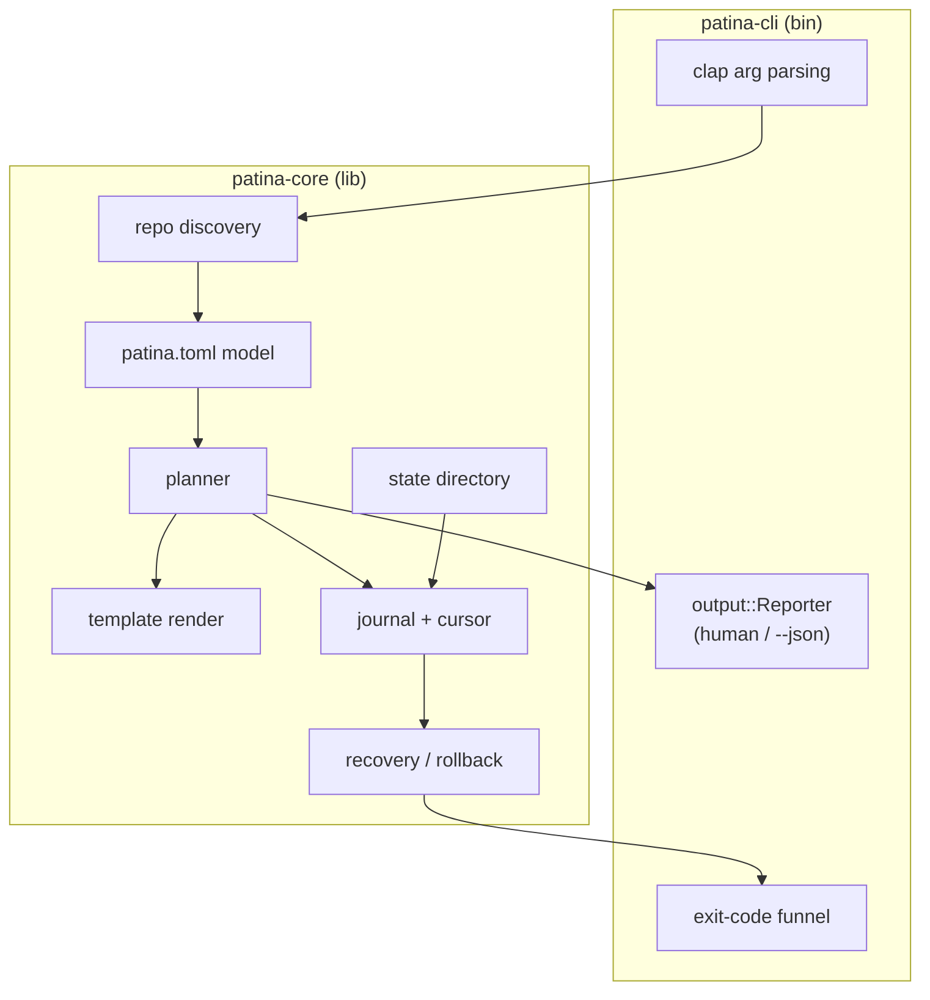
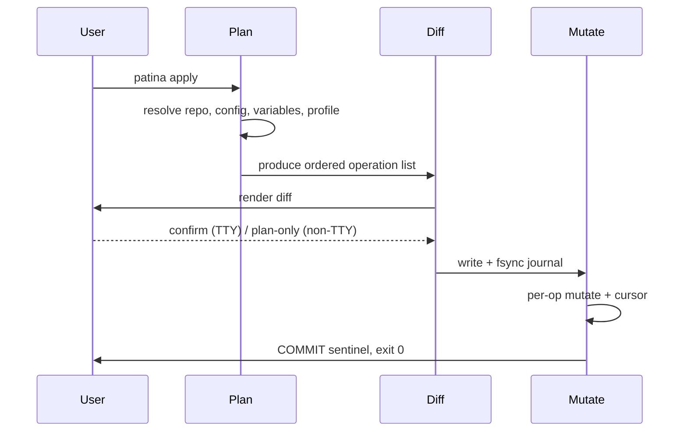

# Patina Architecture

This document orients contributors to how Patina is built: the crate
boundaries, the on-disk journal format, the phases an `apply` moves
through, and the recovery primitives that make a mid-apply crash safe.

## Engine layers

Patina is a three-crate Cargo workspace. The `patina-core` /
`patina-cli` split keeps engine logic free of CLI concerns and lets the
engine be tested without spawning a process; `patina-elevate` is a
standalone Windows-only helper added later for the one-time Developer
Mode elevation flow.

- **`patina-core`** is the library crate. It owns repository discovery,
  the flat `patina.toml` module model, the five file modes, template
  rendering, path canonicalization, the journal and progress cursor,
  crash recovery, backups, and the per-machine state directory. It never
  prints user-facing output directly.
- **`patina-cli`** is the binary crate. It parses arguments with
  `clap`, drives the engine, and renders results through the
  `output::Reporter` abstraction — human-readable by default, JSON under
  `--json`. All process exit codes flow through a single funnel that
  maps engine outcomes onto the formalized codes.
- **`patina-elevate`** is a standalone Windows-only helper binary. It
  carries the smallest possible trust surface — no dependency on
  `patina-core` or `patina-cli` — and exists solely to toggle the
  Developer Mode registry flag under a single UAC prompt. It is gated
  behind a `windows` Cargo feature, so a non-Windows build produces no
  such artifact.

User-facing output never uses `println!` / `eprintln!` outside the
`Reporter` layer; everything else logs through `tracing`. See
AGENTS.md "Hard rules" for the enforcement detail.

## Journal format

Before Patina mutates any file, it writes the entire plan to a journal
in the per-machine state directory and `fsync`s it exactly once. The
journal is the source of truth a later recovery run reads to converge
the filesystem.

The journal is encoded with `postcard`. Because `postcard` makes no
wire-format-stability promise across versions, every journal carries a
version envelope so a future Patina can detect and reject a journal it
cannot decode rather than misread it (see the product north star's
Known-Unknowns note in AGENTS.md).

- The **version envelope** lets recovery refuse an unknown format.
- The **encoded plan** is the full set of operations, written and
  fsynced upfront in a single durable write.
- The **progress cursor** records per-operation completion as the apply
  proceeds. The cursor is written without a per-operation `fsync` — the
  upfront plan fsync plus the filesystem-probing recovery makes per-op
  durability unnecessary.
- The **terminal sentinel** records whether the cycle committed or
  rolled back.

`patina debug journal <path>` decodes a journal back into
human-readable form for post-mortem inspection.

## Apply phases

`patina apply` runs three phases in order. The first two are read-only;
only the third touches the filesystem, and it does so only after the
journal is durable.

1. **Plan.** Resolve the repository, parse `patina.toml`, resolve the
   variable precedence chain and profile, render templates, canonicalize
   paths, and produce an ordered list of operations across the five file
   modes.
2. **Diff.** Compare the planned end-state against the live filesystem
   and present the diff. An interactive TTY prompts for confirmation; a
   non-interactive shell falls through to plan-only and writes nothing.
   Re-applying against unchanged source is a no-op with byte-identical
   stdout.
3. **Mutate.** Write and fsync the journal, take backups before any
   overwrite, apply each operation while advancing the progress cursor,
   and write the terminal sentinel. The process exits through the
   formalized exit-code funnel. Mutations and read-only commands
   coordinate through an advisory file lock.

## Recovery

Crash safety is the engine's headline guarantee: a `kill -9` mid-apply
leaves the filesystem in either the pre-apply or post-apply state,
never an intermediate one.

On the next run, recovery reads the journal envelope, then probes the
filesystem to determine how far the interrupted apply got and converges
deterministically:

- If the journal has no terminal sentinel, recovery uses the progress
  cursor and a filesystem probe to decide, per operation, whether to
  complete the remaining mutations (roll forward) or restore from
  backups (roll back).
- Backups taken before overwrite are retained for the last ten apply
  cycles; older cycles are garbage-collected on the next apply. Backups
  live in the per-machine state directory and never inside the
  repository.

`patina rollback` reverses the last successful apply by reading the
journal and restoring the recorded pre-apply bytes; afterwards the
filesystem matches the pre-apply state byte-for-byte, modulo files the
user touched outside Patina. `patina status` reports drift between the
declared end-state and the live filesystem. The per-machine state
directory that holds journal, backups, lock, and drift cache uses
OS-appropriate locations and must not live on a cloud-sync mount — see
`docs/USER_GUIDE.md` "State directory".
