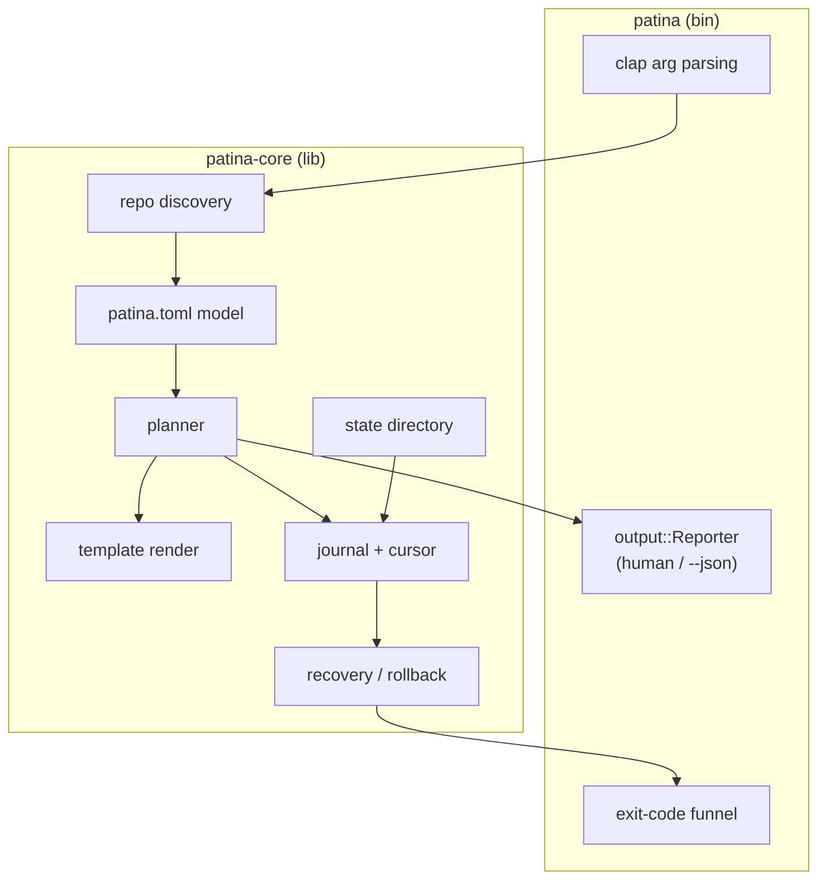
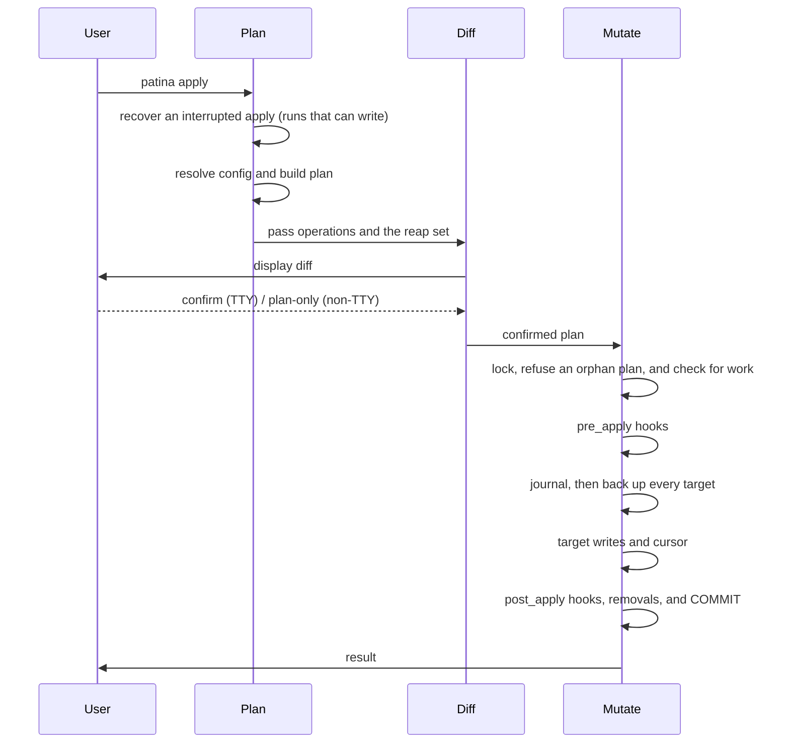

# Patina architecture

Patina's crate boundaries, on-disk journal format, `apply` phases, and
recovery primitives define the architecture for a mid-apply crash.

## Engine layers

Patina is a three-crate Cargo workspace. The `patina-core` /
`patina` split keeps engine logic free of CLI concerns and lets the
engine be tested without spawning a process; `patina-elevate` is a
standalone Windows-only helper for the one-time Developer Mode elevation
flow.

```mermaid
flowchart TD
    subgraph cli["patina (bin)"]
        args["clap arg parsing"]
        reporter["output::Reporter\n(human / --json)"]
        exit["exit-code funnel"]
    end
    subgraph core["patina-core (lib)"]
        discover["repo discovery"]
        config["patina.toml model"]
        plan["planner"]
        render["template render"]
        journal["journal + cursor"]
        recover["recovery / rollback"]
        statedir["state directory"]
    end
    args --> discover
    discover --> config
    config --> plan
    plan --> render
    plan --> journal
    journal --> recover
    plan --> reporter
    recover --> exit
    statedir --> journal
```

- **`patina-core`** is the library crate. It owns repository discovery,
  the flat `patina.toml` module model, and the `[[file]]` /
  `[[directory]]` entry kinds with their materialization modes. It also
  owns template rendering, path canonicalization, the journal and
  progress cursor, crash recovery, backups, and the per-machine state
  directory. It never prints user-facing output directly.
- **`patina`** is the binary crate. It parses arguments with
  `clap`, drives the engine, and renders results through the
  `output::Reporter` abstraction: human-readable by default, JSON under
  `--json`. All process exit codes flow through a single funnel that
  maps engine outcomes, and lock timeouts from commands that take the
  lock themselves, onto the formalized codes.
- **`patina-elevate`** is a standalone Windows-only helper binary. It
  carries the smallest possible trust surface (no dependency on
  `patina-core` or `patina`) and performs one elevated action under a
  single UAC prompt: toggling the Developer Mode registry flag, or
  applying a set of Windows Defender path exclusions. It is gated behind a
  `windows` Cargo feature, so a non-Windows build produces no helper
  artifact.

  The helper also *verifies* its own work, because it is the only part of
  Patina elevated enough to read back what it changed: `Get-MpPreference`
  returns the exclusion list only to an elevated caller. Its verdict
  reaches the launching `patina.exe` through a result file rather than an
  exit code. `ShellExecuteEx` is the only way to raise the UAC dialog
  without `unsafe`, and it returns as soon as the process is created, with
  no handle to wait on. Both launch sites therefore poll for the helper's
  effect.

User-facing output never uses `println!` / `eprintln!` outside the
`Reporter` layer; everything else logs through `tracing`. The workspace
denies Clippy's `print_stdout` and `print_stderr` lints, so any other print
outside test code fails `just lint` unless an `#[expect]` attribute
suppresses the lint.

## Journal format

Before Patina mutates any file, it writes the entire plan to a journal
in the per-machine state directory, then `fsync`s both the plan file and
its parent directory. The journal is the source of truth a later recovery
run reads to converge the filesystem.

The plan file and the commit record are encoded with `postcard`; the
progress cursor is a raw fixed-width byte log. `postcard` promises no
wire-format stability across versions, so every journal opens with a
version envelope. A later Patina binary can then reject a journal it
cannot decode instead of misreading it. See the product north star's
Known unknowns note in AGENTS.md.

```mermaid
flowchart LR
    env["version envelope"] --> plan["encoded plan\n(all operations)"]
    plan --> cursor["progress cursor\n(per-op completion)"]
    cursor --> sentinel["terminal sentinel\nCOMMIT / ROLLED_BACK"]
```

- The **version envelope** lets recovery refuse an unknown format.
- The **encoded plan** is the full set of operations, written and
  fsynced upfront in a single durable write: one symlink, copy, or render
  operation per materialized target, then one `remove` operation per
  target the apply reaps. A removal plan instead records its target and
  manifest writes, together with the target whose declaration it removes.
- The **progress cursor** records per-operation completion as the apply
  proceeds. The cursor is written without a per-operation `fsync`: the
  upfront plan fsync plus the filesystem-probing recovery makes per-op
  durability unnecessary.
- The **terminal sentinel** records whether the cycle committed or
  rolled back. The commit sentinel is written and fsynced in a
  `.partial.<pid>` sibling and renamed into place, so a present sentinel
  always contains a whole record.

The commit record lists the expected state of each materialized target (a
link target, or a content hash and its source) with the disposition the plan
gave it, then the targets the reap removed, in removal order. `patina status`
classifies the live filesystem against the latest record, and `patina rollback`
reverses the apply that the latest record describes.

Every operation gets a unique, ordered ID under the exclusive state lock.
The ID has a UTC timestamp prefix and a 20-digit sequence suffix. Allocation
checks `journal/`, `backups/`, and `recovered/`. If the clock has not advanced
past the newest prefix, the allocator increments its sequence without waiting.
The record stores wall-clock time separately, so clock changes do not affect
operation ordering. Journal and backup paths use this ID, written as `<id>`
below.

`patina remove` and `patina promote` update one target's recorded state without
running an apply. Each derives a record from the latest managed-target record:
`remove` omits its target, and `promote` records the promoted bytes' hash.
Both record every remaining target `Unchanged` and list no reaped targets.
Rollback marks this record as passed without changing files. Subsequent
rollbacks can reverse earlier applies without changing the named target's
current bytes or ownership. Status retains the recorded promoted bytes as its
expectation, even if the user later edits the target. Applies after the command remain reversible,
including their changes to that target.

Each new commit copies the cumulative removal and promotion metadata. Each
edit records its operation ID, target, and expected state; a removal has no
expected state. Status and rollback apply edits newer than the active record.
This metadata survives history pruning. When every retained record has been
closed, promoted targets remain managed and removed targets remain unmanaged.
Rollback then reports that no prior apply remains.

The scanner reads metadata from the newest decodable record. A corrupt active
record allows fallback to an earlier record. A corrupt closed record instead
fails the read, because skipping it could lose ownership edits.

`remove` journals a plan for its target and manifest, then backs up both
before writing either. It replaces or deletes the target, atomically writes
the edited manifest, and publishes its record last. An uncommitted removal
recovers both paths before a retry. The plan identifies the removed target,
so a retry can recover its missing declaration without bypassing the checks
for an unrelated target. An ordinary write failure invokes the same recovery.
`promote` writes the repository source first, then its record.

`patina debug journal <path>` decodes a plan file or a commit record back
into human-readable form for post-mortem inspection.

## Remote cache

The root manifest declares each remote once as a `[[remote]]` table; a
managed entry naming one resolves its source against a checkout of that
repository rather than against its own module directory. Pins are global
and checkouts are local. The planner's remote registry reads the lockfile
when an active entry first selects a remote. It materializes and memoizes
that remote's checkout on first selection. An unselected remote therefore
requires neither a read nor a fetch. The subsystem lives under
`patina-core/src/remote/`:

- The **`git`** module wraps the `git` binary on `PATH` via
  `std::process::Command`. Patina links no git library, so a user's SSH
  agent, credential helpers, and `insteadOf` rewrites apply untouched. The
  layer captures `stderr` into typed errors and prints nothing itself.
- The **`cache`** module owns the layout under `<state>/remotes/`: one bare
  fetch repository per remote plus one immutable directory per pinned rev.
  Each process builds a checkout in `<sha>.partial.<pid>` and renames the
  completed tree to `<sha>`. Only completed trees receive the final name, and
  Patina never writes into a final checkout. Because staging precedes lock
  acquisition, a sweep can encounter another process's staging root. The sweep
  leaves that root alone until its directory modification time is at least 24
  hours old. Writes below the root do not reset the timer.

  A pin change creates another checkout directory instead of modifying the
  directory behind a live symbolic link. Apply changes the link through the
  journal, and rollback can restore its previous destination.
- The **`lockfile`** module reads and writes `patina.lock`. Rendering is
  deterministic (remote-name order, fixed field order), so re-writing
  unchanged pins produces identical bytes.
- The **`gate`** module is a pure function. It decides whether a
  candidate tip may become a pin, so every branch is unit-testable
  without a clock, a network, or a repository.

The sweep reads every journal commit sentinel on disk and keeps each
checkout named by at least one sentinel. Rollback can step through older
records, including records before a removal or promotion. When the sweep cannot decode a sentinel, it
suspends instead of stranding a rollback.

`docs/REMOTE_SOURCES.md` is the normative behavioural spec.

## Apply phases

`patina apply` separates target mutation from planning and consent. Planning
may fill a cold remote cache, but it does not modify the dotfiles repository or
any managed target. Target changes begin only after interactive confirmation
or `--yes` approval.

```mermaid
sequenceDiagram
    participant U as User
    participant P as Plan
    participant D as Diff
    participant M as Mutate
    U->>P: patina apply
    P->>P: recover an interrupted apply (runs that can write)
    P->>P: resolve config and build plan
    P->>D: pass operations and the reap set
    D->>U: display diff
    U-->>D: confirm (TTY) / plan-only (non-TTY)
    D->>M: confirmed plan
    M->>M: lock, refuse an orphan plan, and check for work
    M->>M: pre_apply hooks
    M->>M: journal, then back up every target
    M->>M: target writes and cursor
    M->>M: post_apply hooks, removals, and COMMIT
    M->>U: result
```

1. **Plan.** A run that can write (`--yes`, or the prompt on an interactive
   TTY) first reverts any interrupted apply under the exclusive lock (see
   [Recovery](#recovery)). Planning then resolves the repository, parses
   `patina.toml`, and resolves the variable precedence chain and profile. It
   renders templates, canonicalizes paths, and produces an ordered list of
   operations across the `[[file]]` / `[[directory]]` entry kinds and their
   materialization modes. The list ends with one `Remove` operation per target
   the last commit recorded that the current manifests no longer manage, so
   the reap is part of the durable plan.
2. **Diff.** Compare the planned end-state against the live filesystem
   and present the diff, including a `remove` block for each planned removal.
   An interactive TTY prompts for confirmation; a non-interactive shell falls
   through to plan-only and modifies no repository file or target. Planning
   may already have filled the remote cache.
   Re-applying against unchanged source is a no-op with byte-identical
   stdout.
3. **Mutate.** After acquiring the advisory lock, `execute` checks the journal
   and, when it has an orphan plan, refuses with `InterruptedApplyPending`
   (exit 1) before writing anything. It then checks for work. A plan with only
   `Unchanged` targets, no `Remove`, and an earlier commit returns without
   running hooks or writing files. Any other plan resolves hook shells and runs
   `pre_apply` hooks. If those hooks succeed, `execute` flushes the journal and
   then backs up every target it will overwrite or remove in one pass,
   outermost first, skipping a target inside a target the pass backed up, so
   no backup is written inside another. Only then does `execute` materialize
   its targets and run `post_apply` hooks, so every backup is a copy of the
   pre-apply state. When those hooks succeed, it removes each `Remove`
   target, writes the terminal sentinel, and prunes old history. A required
   `post_apply` hook failure instead rolls back the target operations, deletes
   the run's backup cycle, and
   then deletes the plan. The CLI maps the result to the documented exit code.

### Target kind and mode edits

The target's entry kind is part of the "matches" definition. The shared
content comparison (`status::classify::content_matches`) requires a
regular file at the target before reading it, so a symlink whose
referent's bytes hash equal is drift, not a match. Plan-time
classification and `patina status` both call `content_matches`.
`patina apply` therefore plans a mode edit as an `Update`, while
`patina status` reports `Drifted`, instead of reading through the stale
entry as if it were satisfied.

The diff's `replace` verb is journal-provenance-gated. Planning reads
the latest committed record once and maps each recorded target to its
`(kind, source)`. A target whose live kind flips is a `replace` only
when the record holds the same target from the same source identity
under a different kind: a `mode` edit on one entry. A target claimed by
a different entry (a different source) keeps the plain mode verb with a
kind-aware body.

A symbolic link at a tree-mode target's root is never walked through:
leaf paths under the link resolve into its destination, which can be the
repository's source. The classifier enumerates the source leaves
instead, marks every leaf `Create`, and flags the root for replacement
(`replace_root`). The executor removes a symlinked root only under that
plan-time flag. When the plan is stale relative to the live filesystem,
the apply aborts with the typed `TreeTargetIsSymlink` error before any
leaf write, and the next apply re-plans with consent.

A symbolic link *between* a tree root and its leaves is refused
outright. Tree modes keep intermediate target directories real and
have no consent flow for replacing one: plan-time classification and
the leaf-walking executors run the same interior check
(`InteriorSymlink`) on each target before touching its leaves, and
the error names the link for the user to remove. The check derives its
prefixes from the walked leaves, so an entry that deliberately places a
`symlink-dir` target inside another tree's target keeps working when
the tree's `ignore` excludes that subtree. Ancestors above the declared
root stay out of scope: a symlinked `~/.config` is the user's
filesystem layout, and single-target writes resolve through it. The
gate covers planning and leaf writes only. A tree root replaced by a link
does not redirect the revert paths: planning does not reap a recorded target
under a current tree root that is not a real directory, the backup pass skips
every target beneath a target it backed up, and recovery reverts an operation
beneath a stashed link as that link. Otherwise the orphan reap,
`patina rollback`, and crash recovery revert recorded target paths
without the gate, so a link planted after an apply can still redirect those
single-path operations (see the Known unknowns note in AGENTS.md).

Backup and restore preserve a symbolic link's Windows flavour from the
link's own file type (`fsx::symlink_dir_flavor`), not from a stat of its
destination. A dangling directory link has no destination to stat, and
restoring it with file flavour would lose its directory-link flavour when
the destination returns. `fsx::clone_entry` (backup, crash recovery,
rollback) and the in-process rollback snapshot both pass the flavour to
`fsx::symlink_to`.

### Tree enumeration and `ignore`

Every tree-mode phase enumerates leaves through `apply::walk_files`:
plan-time classification, target-collision claims, the executors, the
committed journal record, and the managed-target set used by `status` and
the orphan reap all call it. It
takes a compiled matcher and prunes ignored directories during descent
rather than filtering a flat result list. Pruning at descent skips reading
inside `__pycache__`, and it drops the nested `__pycache__/x.pyc` too. A
flat filter would keep that file, because gitignore matching tests one
path at a time and a directory pattern never matches a file inside it.

The matcher is built once per entry, in `ignore_rules::build`, from the root
manifest's `[patina] ignore` followed by the entry's own list, anchored at
the entry's canonical source. The resolved entry stores it for every phase
downstream of planning.

`insert_managed_targets` deliberately enumerates unfiltered and partitions
each leaf into managed or ignored, because attributing a reap to a pattern
means seeing the leaves that pattern dropped. Each leaf goes through
`ignore_rules::prunes`, which replays the walk's decision for one relative
path; that function's doc comment says why neither `Gitignore` method
substitutes for it. The partition lets the plan's reap set report `ignored`
rather than an unexplained removal. It costs a read inside every ignored
directory, in `status` and the reap; the executor path skips them.

An entry whose leaves are all ignored materializes nothing, because both
executors create leaf directories on demand. Classification walks before
calling an absent target a `Create`, so such an entry settles instead of
re-prompting on every apply.

An ignored leaf never enters the `ApplyRecord`. Reap reasons are computed
at plan time, by diffing that record against the current managed set, so
the record does not store them.

### Managed targets within a plan

Planning derives operations and managed targets in one pass. Both results use
the same module variables, profile, and command-line overrides. Planning
computes the reap set from that managed-target set and records it in the plan,
so the orphan preview, the reap, and the full-no-op check read one set; none of
those paths reevaluates `when` without the plan's overrides.

`status` and `doctor` have no resolved plan, so
`current_managed_targets` rebuilds the set from the manifests. The walk
evaluates `when` and expands tree entries without fetching a remote checkout.
If a remote checkout is missing, the walk marks its tree roots as
indeterminate to protect their recorded leaves. A missing or wrong-shaped
local tree contributes no leaves, and an invalid ignore list is treated as an
empty list. `status` passes its `-v` values into this walk. `doctor` has no
override flag, and its ignored-target check produces no finding if the walk
fails.

## Recovery

A `kill -9` mid-apply leaves the filesystem in either the pre-apply or
the post-apply state. This crash-safety guarantee covers process
termination while the page cache survives. Backups are copied but not
`fsync`ed before an overwrite. Power loss or a kernel panic mid-apply
can therefore leave an overwrite durable while its backup is not, an
intermediate state. Full power-loss durability (atomic
temp+rename target writes plus `fsync` of backups and parent
directories) is a post-1.0 hardening item.

`patina apply` with `--yes` or at an interactive prompt, and `patina rollback`
with `--yes` or once confirmed, recover under the exclusive lock before they
read the last commit or plan. `patina remove` and `patina promote` recover
under the lock they hold after the user consents and before their first write;
when they refuse or are declined before that point, they warn about a pending
apply as a preview does and write nothing. After its recovery has written,
`patina promote` refuses a target that the recovery changed. Recovery reads
each journal envelope and converges deterministically:

- A plan with no terminal sentinel is an orphan: an apply or removal killed
  after the journal became durable but before it committed. Recovery reverses
  it to the state before the command, deciding per operation from the
  recorded disposition and whether a backup exists. An `Unchanged`
  target is left alone. A target whose live entry matches its backup (same
  kind, bytes, link target, or tree) was never written and is left alone; a
  first recovery pass does not report it. Any other target with a backup is
  restored from it. Without a backup, a `Create` target is deleted, and an
  `Update` or `Remove` target is left in place: the backup pass precedes every
  write, so a target with no entry at its mirror path was never written, or
  lies inside a backed-up directory whose restore covers it. An operation
  whose mirror path passes through a link stashed in the cycle reverts that
  ancestor link instead, so recovery never reads or writes through the stashed
  link or the live one. The decision reads the plan and the backup directory
  rather than the progress cursor. Before it restores over or deletes a live
  entry, recovery copies that entry to
  `<state>/recovered/<id>.<n>/<op index>/<file name>` and reports the copy.
  The per-operation index separates the copies of different operations. A
  retry of a recovery that failed partway reports the copy an earlier pass
  made for the same operation when the live entry still matches that copy or
  the backup. Otherwise the retry reports any earlier copy and then a new one,
  which it copies into `<n>` one past the highest existing number, so no pass
  overwrites an earlier copy. The command then works from the recovered
  filesystem.
- A backup is cloned into a `<mirror path>.partial.<pid>` sibling and renamed
  onto its mirror path, a directory as one unit, so an entry at the mirror
  path is always a complete backup. Recovery and rollback treat a staged
  sibling as no backup and remove it. Retention prunes whole backup cycles,
  including any staged sibling inside a pruned cycle.
- A preview (`patina apply` in a non-interactive shell without `--yes`, or
  with `--json` and no `--yes`) and `patina status` do not recover. A plan
  without a sentinel is an orphan only when read under the lock, so each
  re-reads the journal under the shared lock. Under the lock, they warn on
  stderr that an interrupted apply is pending and describe the files as it
  left them; when the shared lock times out, they warn that an apply is running
  or was interrupted. A preview does not call `execute`. `execute` refuses with
  `InterruptedApplyPending` when it finds an orphan plan under its lock; in the
  CLI that happens only when another apply was killed between this run's
  recovery and its execution.
- Each newly committed apply, removal, or promotion retains the ten newest
  committed operations and their backups. This includes applies that only
  create files and records from remove or promote. Pending operations and their backups remain
  recoverable. Pruning deletes a plan before its terminal sentinels, then
  deletes its backups, so interruption cannot make an old committed plan look
  pending. A pruning failure warns without undoing the committed command.
  Each newly committed apply separately keeps the ten newest `recovered/`
  directories. All of these files live in the per-machine state directory.

`patina rollback` reverses the last successful apply. It reads the
journal and restores the recorded pre-apply bytes. It first restores each
target that the apply's reap removed, using the target's backup in the apply's
backup cycle. Those restores form one atomic unit, which has its own error
when it fails. A reaped target without a backup is left alone. Rollback then reverts
each managed entry as an atomic unit, in reverse apply order. Afterwards the
filesystem matches the pre-apply state in content and entry kind (file,
symlink, or directory). Mode and timestamp bits are excluded. Rollback leaves
a target the apply recorded `Unchanged` in place, so an edit made to it after
the apply remains. At a record from `remove` or `promote`, rollback marks the
record as passed without reversing its targets. While it holds the
exclusive lock, rollback also removes the staging
directories that a killed rollback left under `backups/`.

When reversing earlier applies, rollback skips any restore unit that overlaps
a target protected by a later removal or promotion. This includes an ancestor
directory or backed-up symlink whose restoration would replace the protected
target. The entire unit remains unchanged, even if it also includes unrelated
files. Recovery-copy indices retain their positions in the original record.

Before rollback replaces or deletes a live entry that differs from what the
record expects, it copies that entry to
`<state>/recovered/<id>.<n>/<index>/<file name>` and reports the copy. The
record expects a symlink to its recorded link target, a regular file with its
recorded hash, or, for a reaped target, nothing. A live entry that already
matches its backup is left in place.

A replaced tree root reverts as a unit: when a recorded leaf's
backup mirror path passes through a symbolic link stashed in the cycle's
backup tree, rollback
restores that ancestor link and never reverts a leaf through it, because a
leaf path under the restored link would resolve into the repository. This
also applies when an interrupted rollback deleted the live root or another
entry replaced it before the retry. Crash recovery uses the same rule.
In-process reversal after a failed `post_apply` hook also restores the ancestor
link as a unit, but only when its live counterpart is still a directory.
Rollback keeps a copy of the replaced root unless every file and link in it is
a recorded leaf that matches its record.

`patina status` reports drift
between the declared end-state and the live filesystem. The per-machine
state directory for the journal, backups, and lock uses
OS-appropriate locations and must not live on a cloud-sync mount. See
`docs/OPERATING_ENVIRONMENT.md`.
