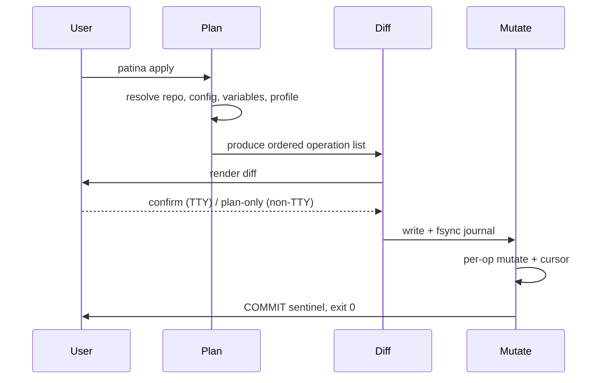

# Patina Architecture

This document orients contributors to how Patina is built: the crate
boundaries, the on-disk journal format, the phases an `apply` moves
through, and the recovery primitives that make a mid-apply crash safe.

## Engine layers

Patina is a three-crate Cargo workspace. The `patina-core` /
`patina-cli` split keeps engine logic free of CLI concerns and lets the
engine be tested without spawning a process; `patina-elevate` is a
standalone Windows-only helper added later for the one-time Developer
Mode elevation flow.

```mermaid
flowchart TD
    subgraph cli["patina-cli (bin)"]
        args["clap arg parsing"]
        reporter["output::Reporter\n(human / --json)"]
        exit["exit-code funnel"]
    end
    subgraph core["patina-core (lib)"]
        discover["repo discovery"]
        config["patina.toml model"]
        plan["planner"]
        render["template render"]
        journal["journal + cursor"]
        recover["recovery / rollback"]
        statedir["state directory"]
    end
    args --> discover
    discover --> config
    config --> plan
    plan --> render
    plan --> journal
    journal --> recover
    plan --> reporter
    recover --> exit
    statedir --> journal
```

- **`patina-core`** is the library crate. It owns repository discovery,
  the flat `patina.toml` module model, the `[[file]]` / `[[directory]]`
  entry kinds and their materialization modes, template
  rendering, path canonicalization, the journal and progress cursor,
  crash recovery, backups, and the per-machine state directory. It never
  prints user-facing output directly.
- **`patina-cli`** is the binary crate. It parses arguments with
  `clap`, drives the engine, and renders results through the
  `output::Reporter` abstraction: human-readable by default, JSON under
  `--json`. All process exit codes flow through a single funnel that
  maps engine outcomes onto the formalized codes.
- **`patina-elevate`** is a standalone Windows-only helper binary. It
  carries the smallest possible trust surface (no dependency on
  `patina-core` or `patina-cli`) and performs one elevated action under a
  single UAC prompt: toggling the Developer Mode registry flag, or
  applying a set of Windows Defender path exclusions. It is gated behind a
  `windows` Cargo feature, so a non-Windows build produces no such
  artifact.

  The helper also *verifies* its own work, because it is the only part of
  Patina elevated enough to read back what it changed: `Get-MpPreference`
  withholds the exclusion list from an unelevated caller. Its verdict
  reaches the launching `patina.exe` through a result file rather than an
  exit code. `ShellExecuteEx` is the only way to raise the UAC dialog
  without `unsafe`, and it returns as soon as the process is created,
  keeping no handle to wait on, so both launch sites poll for the helper's
  effect instead of reading a status.

User-facing output never uses `println!` / `eprintln!` outside the
`Reporter` layer; everything else logs through `tracing`. See
AGENTS.md "Hard rules" for the enforcement detail.

## Journal format

Before Patina mutates any file, it writes the entire plan to a journal
in the per-machine state directory and `fsync`s it up front, both the
plan file and its parent directory. The journal is the source of truth a
later recovery run reads to converge the filesystem.

The plan file and the commit record are encoded with `postcard`; the
progress cursor is a raw fixed-width byte log. Because `postcard` makes no
wire-format-stability promise across versions, every journal carries a
version envelope so a future Patina can detect and reject a journal it
cannot decode rather than misread it (see the product north star's
Known-Unknowns note in AGENTS.md).

```mermaid
flowchart LR
    env["version envelope"] --> plan["encoded plan\n(all operations)"]
    plan --> cursor["progress cursor\n(per-op completion)"]
    cursor --> sentinel["terminal sentinel\nCOMMIT / ROLLED_BACK"]
```

- The **version envelope** lets recovery refuse an unknown format.
- The **encoded plan** is the full set of operations, written and
  fsynced upfront in a single durable write.
- The **progress cursor** records per-operation completion as the apply
  proceeds. The cursor is written without a per-operation `fsync`: the
  upfront plan fsync plus the filesystem-probing recovery makes per-op
  durability unnecessary.
- The **terminal sentinel** records whether the cycle committed or
  rolled back.

`patina debug journal <path>` decodes a journal back into
human-readable form for post-mortem inspection.

## Remote cache

A module carrying a `[remote]` table resolves its entry sources against a
checkout of another repository rather than against its own directory. The
subsystem is four small pieces under `patina-core/src/remote/`:

- **`git`** wraps the `git` binary on `PATH` via `std::process::Command`.
  Patina links no git library, so a user's SSH agent, credential helpers,
  and `insteadOf` rewrites apply untouched. The layer captures `stderr`
  into typed errors and prints nothing itself.
- **`cache`** owns the layout under `<state>/remotes/`: one bare fetch
  repository per module plus one immutable directory per pinned rev. A
  checkout is written into a `<sha>.partial` sibling and renamed into
  place, so a directory's existence means it is complete. Because a new
  rev gets a *new* directory, an update never mutates content under a
  live symbolic link — apply re-points the link through the ordinary
  journaled flow, and rollback can re-point it back.
- **`lockfile`** reads and writes `patina.lock`. Rendering is
  deterministic (module-name order, fixed field order), so re-writing
  unchanged pins produces identical bytes.
- **`gate`** is a pure function deciding whether a candidate tip may
  become a pin, so every branch is unit-testable without a clock, a
  network, or a repository.

Pruning is reachability-based over every journal commit sentinel on disk,
not "keep the newest": rollback walks back through older records, so a
checkout an older record still names must survive. When any sentinel
cannot be decoded, the sweep is suspended rather than risking a stranded
rollback.

`docs/REMOTE_SOURCES.md` is the normative behavioural spec.

## Apply phases

`patina apply` runs three phases in order. The first two are read-only;
only the third touches the filesystem, and it does so only after the
journal is durable.

```mermaid
sequenceDiagram
    participant U as User
    participant P as Plan
    participant D as Diff
    participant M as Mutate
    U->>P: patina apply
    P->>P: resolve repo, config, variables, profile
    P->>D: produce ordered operation list
    D->>U: render diff
    U-->>D: confirm (TTY) / plan-only (non-TTY)
    D->>M: write + fsync journal
    M->>M: per-op mutate + cursor
    M->>U: COMMIT sentinel, exit 0
```

1. **Plan.** Resolve the repository, parse `patina.toml`, resolve the
   variable precedence chain and profile, render templates, canonicalize
   paths, and produce an ordered list of operations across the
   `[[file]]` / `[[directory]]` entry kinds and their materialization
   modes.
2. **Diff.** Compare the planned end-state against the live filesystem
   and present the diff. An interactive TTY prompts for confirmation; a
   non-interactive shell falls through to plan-only and writes nothing.
   Re-applying against unchanged source is a no-op with byte-identical
   stdout.
3. **Mutate.** Write and fsync the journal, take backups before any
   overwrite, apply each operation while advancing the progress cursor,
   and write the terminal sentinel. The process exits through the
   formalized exit-code funnel. Mutations and read-only commands
   coordinate through an advisory file lock.

## Recovery

Crash safety is the engine's headline guarantee: a `kill -9` mid-apply
leaves the filesystem in either the pre-apply or post-apply state,
never an intermediate one. This holds for process termination, where
the page cache survives. Backups are copied but not `fsync`ed before an
overwrite, so power loss or a kernel panic mid-apply can leave an
overwrite durable while its backup is not, a genuinely intermediate
state. Full power-loss durability (atomic temp+rename target writes plus
`fsync` of backups and parent directories) is a post-1.0 hardening item.

On the next run, before computing a fresh plan, recovery reads each
journal envelope and converges deterministically:

- A plan with no terminal sentinel is an orphan: an apply killed after
  the journal became durable but before it committed. Recovery reverses
  it backward to the pre-apply state, deciding per operation from the
  recorded disposition and whether a backup exists. An `Unchanged`
  target is left alone, a target with a backup is restored from it, and
  a target with no backup was a fresh creation and is deleted. The
  decision reads the filesystem and the backup directory, never the
  progress cursor. The engine then computes and applies a fresh plan.
- Backups taken before an overwrite are retained for the last ten apply
  cycles; older cycles are pruned at the end of each successful apply,
  right after its COMMIT. Backups live in the per-machine state
  directory and never inside the repository.

`patina rollback` reverses the last successful apply by reading the
journal and restoring the recorded pre-apply bytes; afterwards the
filesystem matches the pre-apply state in content and entry kind (file,
symlink, or directory), modulo mode/timestamp bits and files the user
touched outside Patina. `patina status` reports drift between the
declared end-state and the live filesystem. The per-machine state
directory that holds journal, backups, lock, and drift cache uses
OS-appropriate locations and must not live on a cloud-sync mount. See
`docs/USER_GUIDE.md` "State directory".
