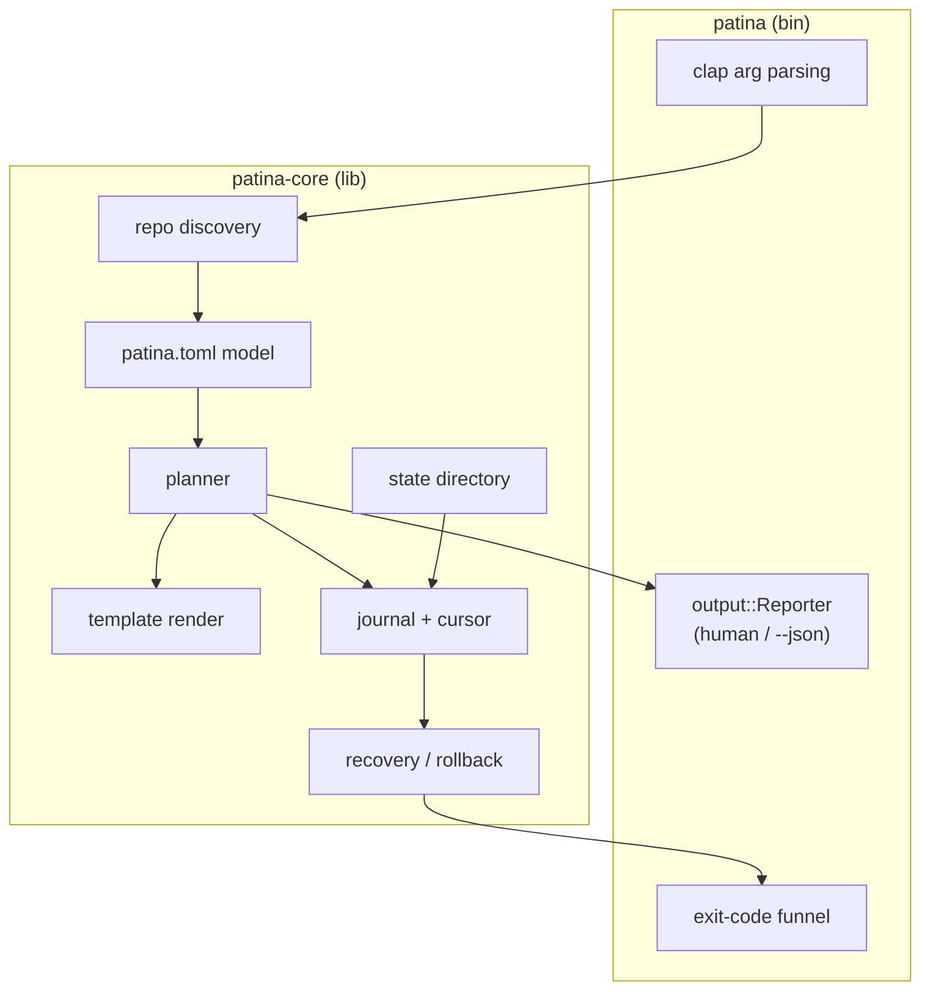
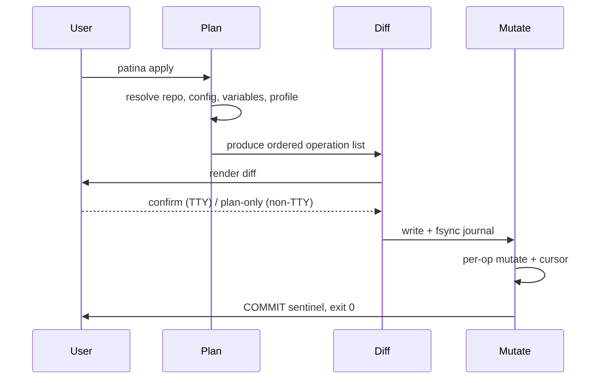

# Patina architecture

Patina's crate boundaries, on-disk journal format, `apply` phases, and
recovery primitives define the architecture for a mid-apply crash.

## Engine layers

Patina is a three-crate Cargo workspace. The `patina-core` /
`patina` split keeps engine logic free of CLI concerns and lets the
engine be tested without spawning a process; `patina-elevate` is a
standalone Windows-only helper for the one-time Developer Mode elevation
flow.

```mermaid
flowchart TD
    subgraph cli["patina (bin)"]
        args["clap arg parsing"]
        reporter["output::Reporter\n(human / --json)"]
        exit["exit-code funnel"]
    end
    subgraph core["patina-core (lib)"]
        discover["repo discovery"]
        config["patina.toml model"]
        plan["planner"]
        render["template render"]
        journal["journal + cursor"]
        recover["recovery / rollback"]
        statedir["state directory"]
    end
    args --> discover
    discover --> config
    config --> plan
    plan --> render
    plan --> journal
    journal --> recover
    plan --> reporter
    recover --> exit
    statedir --> journal
```

- **`patina-core`** is the library crate. It owns repository discovery,
  the flat `patina.toml` module model, and the `[[file]]` /
  `[[directory]]` entry kinds with their materialization modes. It also
  owns template rendering, path canonicalization, the journal and
  progress cursor, crash recovery, backups, and the per-machine state
  directory. It never prints user-facing output directly.
- **`patina`** is the binary crate. It parses arguments with
  `clap`, drives the engine, and renders results through the
  `output::Reporter` abstraction: human-readable by default, JSON under
  `--json`. All process exit codes flow through a single funnel that
  maps engine outcomes onto the formalized codes.
- **`patina-elevate`** is a standalone Windows-only helper binary. It
  carries the smallest possible trust surface (no dependency on
  `patina-core` or `patina`) and performs one elevated action under a
  single UAC prompt: toggling the Developer Mode registry flag, or
  applying a set of Windows Defender path exclusions. It is gated behind a
  `windows` Cargo feature, so a non-Windows build produces no helper
  artifact.

  The helper also *verifies* its own work, because it is the only part of
  Patina elevated enough to read back what it changed: `Get-MpPreference`
  returns the exclusion list only to an elevated caller. Its verdict
  reaches the launching `patina.exe` through a result file rather than an
  exit code. `ShellExecuteEx` is the only way to raise the UAC dialog
  without `unsafe`, and it returns as soon as the process is created, with
  no handle to wait on. Both launch sites therefore poll for the helper's
  effect.

User-facing output never uses `println!` / `eprintln!` outside the
`Reporter` layer; everything else logs through `tracing`. See
AGENTS.md "Hard rules" for the enforcement detail.

## Journal format

Before Patina mutates any file, it writes the entire plan to a journal
in the per-machine state directory, then `fsync`s both the plan file and
its parent directory. The journal is the source of truth a later recovery
run reads to converge the filesystem.

The plan file and the commit record are encoded with `postcard`; the
progress cursor is a raw fixed-width byte log. `postcard` promises no
wire-format stability across versions, so every journal opens with a
version envelope. A later Patina binary can then reject a journal it
cannot decode instead of misreading it. See the product north star's
Known unknowns note in AGENTS.md.

```mermaid
flowchart LR
    env["version envelope"] --> plan["encoded plan\n(all operations)"]
    plan --> cursor["progress cursor\n(per-op completion)"]
    cursor --> sentinel["terminal sentinel\nCOMMIT / ROLLED_BACK"]
```

- The **version envelope** lets recovery refuse an unknown format.
- The **encoded plan** is the full set of operations, written and
  fsynced upfront in a single durable write.
- The **progress cursor** records per-operation completion as the apply
  proceeds. The cursor is written without a per-operation `fsync`: the
  upfront plan fsync plus the filesystem-probing recovery makes per-op
  durability unnecessary.
- The **terminal sentinel** records whether the cycle committed or
  rolled back.

`patina debug journal <path>` decodes a journal back into
human-readable form for post-mortem inspection.

## Remote cache

The root manifest declares each remote once as a `[[remote]]` table; a
managed entry naming one resolves its source against a checkout of that
repository rather than against its own module directory. Pins are global
and checkouts are local. The planner's remote registry reads the lockfile
when an active entry first selects a remote. It materializes and memoizes
that remote's checkout on first selection. An unselected remote therefore
requires neither a read nor a fetch. The subsystem lives under
`patina-core/src/remote/`:

- The **`git`** module wraps the `git` binary on `PATH` via
  `std::process::Command`. Patina links no git library, so a user's SSH
  agent, credential helpers, and `insteadOf` rewrites apply untouched. The
  layer captures `stderr` into typed errors and prints nothing itself.
- The **`cache`** module owns the layout under `<state>/remotes/`: one bare
  fetch repository per remote plus one immutable directory per pinned rev.
  A checkout is written into a `<sha>.partial` sibling and renamed into
  place, so a directory's existence means it is complete. Because a new rev
  gets a *new* directory, an update never mutates content under a live
  symbolic link. Apply re-points the link through the ordinary journaled
  flow, and rollback can re-point it back.
- The **`lockfile`** module reads and writes `patina.lock`. Rendering is
  deterministic (remote-name order, fixed field order), so re-writing
  unchanged pins produces identical bytes.
- The **`gate`** module is a pure function. It decides whether a
  candidate tip may become a pin, so every branch is unit-testable
  without a clock, a network, or a repository.

The sweep reads every journal commit sentinel on disk and keeps each
checkout named by at least one sentinel, because rollback walks back
through older records. When the sweep cannot decode a sentinel, it
suspends instead of stranding a rollback.

`docs/REMOTE_SOURCES.md` is the normative behavioural spec.

## Apply phases

`patina apply` runs three phases in order. Plan and Diff only read.
Mutate is the phase that touches the filesystem, and only after the
journal is durable.

```mermaid
sequenceDiagram
    participant U as User
    participant P as Plan
    participant D as Diff
    participant M as Mutate
    U->>P: patina apply
    P->>P: resolve repo, config, variables, profile
    P->>D: produce ordered operation list
    D->>U: render diff
    U-->>D: confirm (TTY) / plan-only (non-TTY)
    D->>M: write + fsync journal
    M->>M: per-op mutate + cursor
    M->>U: COMMIT sentinel, exit 0
```

1. **Plan.** Resolve the repository, parse `patina.toml`, and resolve the
   variable precedence chain and profile. Render templates, canonicalize
   paths, and produce an ordered list of operations across the
   `[[file]]` / `[[directory]]` entry kinds and their materialization
   modes.
2. **Diff.** Compare the planned end-state against the live filesystem
   and present the diff. An interactive TTY prompts for confirmation; a
   non-interactive shell falls through to plan-only and writes nothing.
   Re-applying against unchanged source is a no-op with byte-identical
   stdout.
3. **Mutate.** Write and fsync the journal, take backups before any
   overwrite, apply each operation while advancing the progress cursor,
   and write the terminal sentinel. The process exits through the
   formalized exit-code funnel. Mutations and read-only commands
   coordinate through an advisory file lock.

### Tree enumeration and `ignore`

Every tree-mode phase enumerates leaves through `apply::walk_files`:
plan-time classification, target-collision claims, the executors, the
committed journal record, and the managed-target set used by `status` and
the orphan reap all call it. It
takes a compiled matcher and prunes ignored directories during descent
rather than filtering a flat result list. Pruning at descent skips reading
inside `__pycache__`, and it drops the nested `__pycache__/x.pyc` too. A
flat filter would keep that file, because gitignore matching tests one
path at a time and a directory pattern never matches a file inside it.

The matcher is built once per entry, in `ignore_rules::build`, from the root
manifest's `[patina] ignore` followed by the entry's own list, anchored at
the entry's canonical source. The resolved entry stores it for every phase
downstream of planning.

`insert_managed_targets` deliberately enumerates unfiltered and partitions
each leaf into managed or ignored, because attributing a reap to a pattern
means seeing the leaves that pattern dropped. Each leaf goes through
`ignore_rules::prunes`, which replays the walk's decision for one relative
path; that function's doc comment says why neither `Gitignore` method
substitutes for it. The partition lets `plan_orphans` return `ignored`
rather than an unexplained removal. It costs a read inside every ignored
directory, in `status` and the reap; the executor path skips them.

An entry whose leaves are all ignored materializes nothing, because both
executors create leaf directories on demand. Classification walks before
calling an absent target a `Create`, so such an entry settles instead of
re-prompting on every apply.

An ignored leaf never enters the `ApplyRecord`. Reap reasons are computed
at plan time, by diffing that record against the current managed set, so
the on-disk format is unchanged.

## Recovery

A `kill -9` mid-apply leaves the filesystem in either the pre-apply or
the post-apply state. This crash-safety guarantee covers process
termination while the page cache survives. Backups are copied but not
`fsync`ed before an overwrite. Power loss or a kernel panic mid-apply
can therefore leave an overwrite durable while its backup is not, an
intermediate state. Full power-loss durability (atomic
temp+rename target writes plus `fsync` of backups and parent
directories) is a post-1.0 hardening item.

On the next run, before computing a fresh plan, recovery reads each
journal envelope and converges deterministically:

- A plan with no terminal sentinel is an orphan: an apply killed after
  the journal became durable but before it committed. Recovery reverses
  it to the pre-apply state, deciding per operation from the
  recorded disposition and whether a backup exists. An `Unchanged`
  target is left alone. A target with a backup is restored from it. A
  target with no backup was a fresh creation, so it is deleted. The
  decision reads the filesystem and the backup directory rather than
  the progress cursor. The engine then computes and applies a fresh plan.
- Backups taken before an overwrite are retained for the last ten apply
  cycles; older cycles are pruned at the end of each successful apply,
  right after its COMMIT. Backups live in the per-machine state
  directory, outside the repository.

`patina rollback` reverses the last successful apply. It reads the
journal and restores the recorded pre-apply bytes. Afterwards the
filesystem matches the pre-apply state in content and entry kind (file,
symlink, or directory). Mode and timestamp bits are excluded, as are
files the user touched outside Patina. `patina status` reports drift
between the declared end-state and the live filesystem. The per-machine
state directory for the journal, backups, lock, and drift cache uses
OS-appropriate locations and must not live on a cloud-sync mount. See
`docs/OPERATING_ENVIRONMENT.md`.
